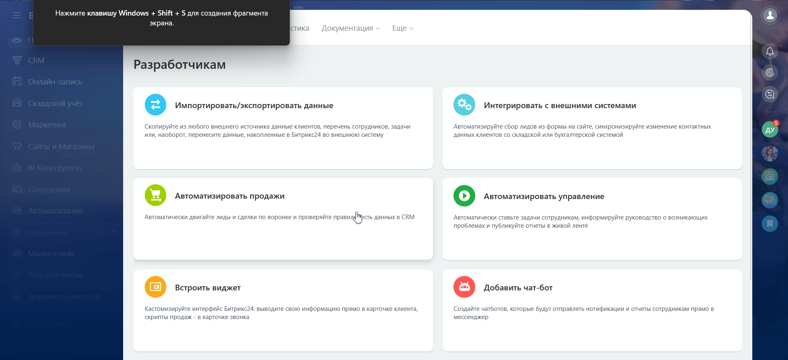
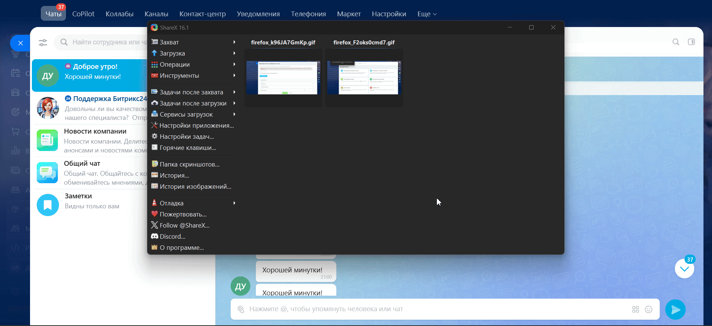

# Bitrix чат бот node js
## Что сделано?

1. В соответствии с [документацией](https://apidocs.bitrix24.ru/access-to-rest-api.html) на сайте [Битрикс](https://www.bitrix24.ru/) зарегистрировался, взял бесплатный пробный период на 90 дней подписки на Маркетплейс.
2. В меню "Разработчикам"-"Добавить чат-бота" сгенирировал вебхук, код бота, client_id бота


3. Основываясь на документации и [инструкции](https://bitrix-tools.github.io/b24jssdk/guide/example-hook-node-work.html) создал:

    - файл .env.local
    - установил необходимые зависимости
    - создал бота, к которому отправив сообщение/начав чат подключается пользователь.
    В 07:00 по Красноярскому времени бот пожелает "Доброго утра". Также бот желает "Хорошей минутки" каждую минуту (сделано для проверки работоспособности)
    - nginx и node сервер запускаются с помощью docker'a


## Как запустить на сервере?
1. На основе примера `.env.example` создать `.env.local` файл
1. Установить [docker](https://docs.docker.com/engine/install/)
1. Установить [docker-compose](https://docs.docker.com/compose/install/)
1. На сервере не должны быть занят 80 порт
1. выполнить команду
```bash
docker-compose up -d
```